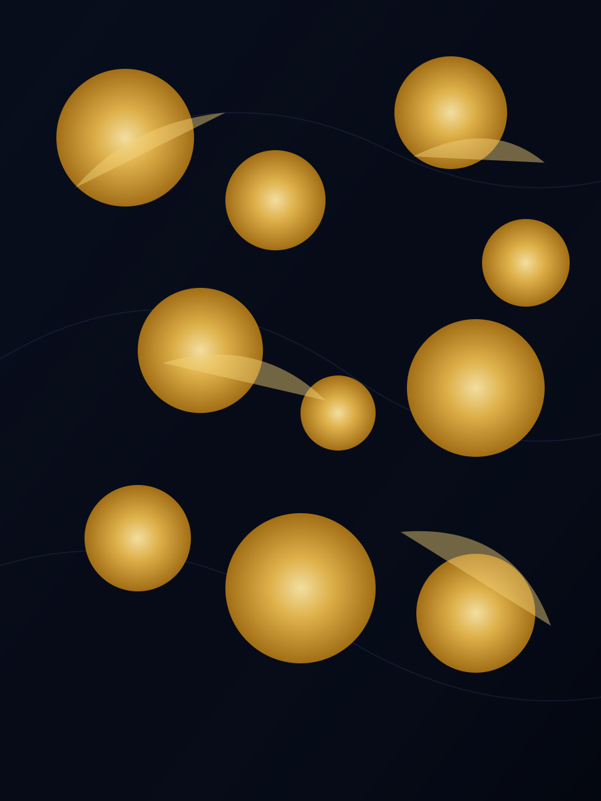

# Orbital Operating Systems

Hi, I’m **@LoneFarrell**—a systems thinker mapping technology practice around a constellation of operating systems, automation, and human-centered design.

## OS Flight Deck

| OS | Mission Role | Core Stack | Current Focus |
| --- | --- | --- | --- |
| Linux | Rapid prototyping & self-hosting | NixOS • Docker • Tailscale | Automating research phones and edge nodes for community labs. |
| macOS | Storycraft & creative assembly | Logic Pro • Affinity Suite • Raycast | Building narrative explainers that weave art, algebra, and future tech. |
| Windows | Business ops & co-creation | Power BI • Excel • VS Code | Streamlining accounting automation with transparent reporting loops. |

## Daily Telemetry

- 🌐 **Civic crypto & UBI pilots** – exploring incentive systems that stay accountable to people, not speculation.
- 🎮 **Playable learning** – designing small, code-driven games that translate complex math into approachable stories.
- 🛰️ **Signal curation** – synthesizing AI, automation, and climate tech news into weekly field notes.

## Learning Trajectory

- Container-native pipelines that keep research devices reproducible and secure.
- Multimodal storytelling techniques to bridge outdoor photography with AI-assisted narration.
- Ethical AI governance frameworks tuned for cooperative communities.

## Collaboration Signals

- Transparent fintech or accounting automation that puts clarity before growth hacks.
- Experiential projects that celebrate wilderness while nudging mindful technology use.
- Open-source experiments that invite people into the build loop early and often.

## Connect

- 📧 **Email**: cfarrell929@gmail.com · cfarrell929@outlook.com
- 😄 **Pronouns**: he/him
- 💬 **DMs**: GitHub Issues or Mastodon (@lonefarrell@indieweb.social)

> “Align each orbit. Let the operating system guide the harvest.”
